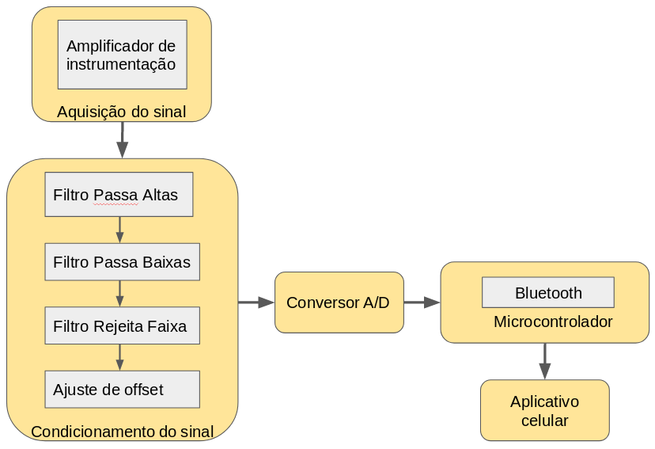

#Eletrocardiógrafo
======
**ATENÇÃO: Em desenvolvimento.**

Projeto para a disciplina PIN22107 do curso de Graduação em Engenharia Eletrônica do Instituto Federal de Santa Catarina. Consiste no projeto e execução de um eletrocardiógrafo de baixo consumo energético capaz de adquirir um sinal de eletrocardiograma por meio de 3 eletrodos e enviar suas medições para um aplicativo de aparelho celular.

## Especificações de projeto
------
* Baixo consumo energético.

* Capaz de medir sinais entre 0,05 e 100 Hz.

## Etapas do projeto
------
* **Aquisição do sinal:** Por meio de eletrodos conectados ao paciente, verificando e garantindo a proteção do mesmo, com processo de isolamento do sistema. Os sinais obtidos diretamente do eletrodo tem amplitude reduzida, atingindo 1 mV com uma frequência na faixa entre 0,05 e 100 Hz. Desse modo, para uma melhor visualização e manipulação, uma etapa de amplificação é necessária, tomando cuidado com a rejeição de ruído de modo comum.

* **Filtros:** Um filtro passa faixa deve ser implementado para seleção da banda de operação desejada, este filtro pode ser composto por um passa altas em série com um passa baixas, além disso, deve-se atentar para o fato de que a frequência da rede elétrica pode afetar o sinal e, portanto, deve ser removida por meio de um filtro rejeita faixa, com alto fator de qualidade. 

* **Digitalização:**  A conversão do sinal analógico para digital pode ser realizada através de um conversor dedicado ou até mesmo por meio do conversor integrado de algum microcontrolador, como por exemplo o ATMEGA328p.

* **Processamento digital:** Envio dos dados para o aplicativo de celular.

## Fluxograma
------
Para uma melhor organização e visualização das etapas necessárias, foi construído o seguinte fluxograma:

## Cronograma de atividades
------

## Autores
------
- João Bassani
- Ricardo Cirio

## Bibliografia
------
