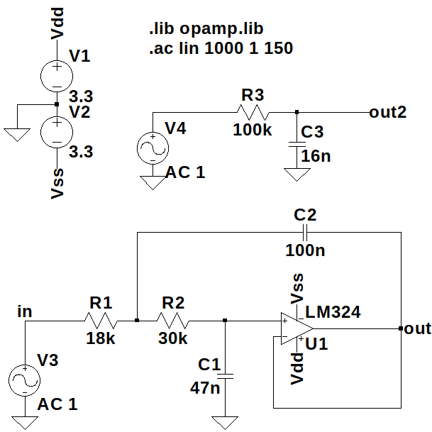
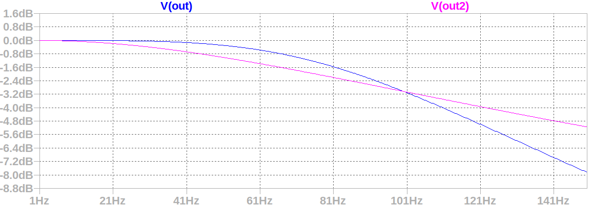
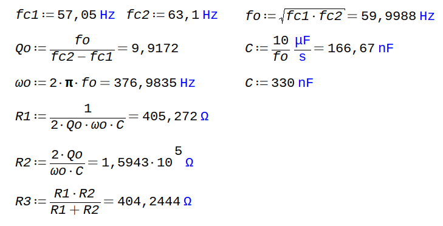

# Eletrocardiógrafo

Projeto para a disciplina PIN22107 do curso de Graduação em Engenharia Eletrônica do Instituto Federal de Santa Catarina. Consiste na concepção e execução de um eletrocardiógrafo de baixo consumo energético capaz de adquirir um sinal de eletrocardiograma por meio de 3 eletrodos e enviar suas medições para um aplicativo de aparelho celular.

## Especificações de projeto
* Energizado por bateria, portanto apresentando baixo consumo energético.

* Capaz de medir sinais entre 0,05 e 100 Hz, permitindo visualização e análise da morfologia do sinal cardíaco humano com propriedade.

## Etapas do projeto
* **Aquisição do sinal:** Por meio de eletrodos conectados ao paciente, verificando e garantindo a proteção do mesmo, com processo de isolamento do sistema. Os sinais obtidos diretamente dos eletrodos tem amplitude reduzida, atingindo 1 mV com uma frequência na faixa entre 0,05 e 100 Hz. Desse modo, para uma melhor visualização e manipulação, uma etapa de amplificação é necessária, tomando cuidado com a rejeição de ruído de modo comum.

* **Filtros:** Um filtro passa faixa deve ser implementado para seleção da banda de operação desejada, podendo ser composto por um passa altas em série com um passa baixas e, além disso, deve-se atentar para o fato de que a frequência da rede elétrica pode interferir no sinal e, portanto, deve ser removida por meio de um filtro rejeita faixa, com alto fator de qualidade.

* **Adequação do sinal:** Além de um ajuste de offset, é necessário implementar um controle de ganho que adeque a amplitude do sinal, preparando-o para digitalização por meio de um ADC.

* **Digitalização:**  A conversão do sinal analógico para digital pode ser realizada através de um conversor dedicado ou até mesmo por meio do conversor integrado de algum microcontrolador, como por exemplo o ATMEGA328p.

* **Processamento digital:** Envio dos dados via Bluetooth para o aplicativo de celular.

## Fluxograma
Para uma melhor organização e visualização das etapas necessárias, foi construído o seguinte fluxograma:

## Aquisição do sinal
Contando com um amplificador de instrumentação de alta relação sinal-ruído (SNR), o estágio inicial de amplificação faz a leitura do sinal diferencial entre os eletrodos esquerdo e direito, ao mesmo tempo que injeta uma referência por meio de um terceiro eletrodo conectado ao paciente.

O esquemático do circuito utilizado nesse estágio pode ser verificado a seguir, sendo baseado no circuito proposto e verificado na folha de dados do próprio fabricante:

## Filtros
Os filtros passa-baixas, passa-altas e rejeita-faixa foram projetados conforme o equacionamento descrito pelo livro "Amplificadores Operacionais e Filtros Ativos". As simulações foram realizadas no _software_ LTspice XVII. Foi definido inicialmente ganho unitário para todos os filtros.

### Passa-altas
Projetou-se o filtro passa-altas com ganho unitário na estrutura _voltage-controlled voltage source_ (VCVS).

Por meio do uso do software de simulação, o comportamento resultante do filtro é:

### Passa-baixas
Abaixo é possível seguir a sequência de passos utilizados na construção do filtro passa-baixas:

No intuito de otimizar a eficiência energética do eletrocardiógrafo, foi analisada a possibilidade de implementar um filtro passa-baixas passivo, portanto foi realizada uma comparação entre o filtro projetado de 2ª ordem com um filtro passivo na simulação.

Apesar da economia de componentes apresentada pelo filtro passivo, sua atenuação na banda passante é indesejada e, portanto, optou-se pela utilização do filtro de 2ª ordem, que apresenta ainda decaimento de 40 dB por década na rejeição e consequentemente um fator de qualidade mais elevado.

### Rejeita-faixa

Inicialmente, projetou-se o filtro notch ativo para rejeitar ruídos oriundos da rede elétrica de 60 Hz.

Entretanto, devido à sensibilidade deste filtro aos valores dos componentes utilizados, e a necessidade de um elevado fator de qualidade, concluiu-se que implementá-lo digitalmente seria uma alternativa mais apropriada. Além disso, pelo fato do circuito ser alimentado via bateria, a interferência da rede é fortemente reduzida, embora não completamente eliminada.

## Automatic Gain Control (AGC)

Ao longo do projeto, verificou-se que seria interessante a implementação de um ajuste de ganho automático devido à incerteza na amplitude do sinal de entrada, já que o mesmo varia conforme o biotipo do paciente e disposição dos eletrodos, possibilitando que a amplificação seja insuficiente ou demasiada.

Após analisar e estudar diversas maneiras de implementar um sistema de adequação do sinal, buscando obter uma excursão adequada e constante para diferentes amplitudes de entrada, surgiu como uma solução conveniente a ideia de um controle de ganho automático (AGC) por meio de um amplificador operacional não-inversor com a resistência de um JFET participando de sua realimentação negativa e influenciando diretamente em seu ganho de amplificação.

Embora seja possível controlar a resistência do JFET apropriadamente através da aplicação de um PWM gerado pelo microcontrolador que adquire o sinal, isso exige mais processamento do mesmo e consequentemente eleva seu consumo energético. Sendo assim, a alternativa escolhida foi a de controlar esse sistema de maneira analógica.

Com o auxílio do LTSpice, traçou-se, em simulação, a curva da resistência Rds em função da tensão Vgs do BF245B, transistor selecionado para o circuito.

É notável a grande variação em sua resistência que ocorre em um pequeno intervalo de variação de Vgs. Devido a isso, percebe-se que é por volta desse intervalo que o JFET deve operar. Logo, projetou-se um circuito para fechar a malha de realimentação do AGC, constituído de um retificador de precisão inversor com ajuste de ganho, que detecta e inverte a tensão de pico positiva do sinal, mantendo o valor negativo obtido, utilizado para controlar o estrangulamento no canal do transistor, controlando sua condutividade. 

O ajuste de ganho da realimentação, proporcionado pelo trimpot RV1, permite que se encontre o ponto ideal de operação do BF245B e também possibilita a definição de um valor limite para o sinal amplificado pelo AGC.

## Somador

Na intenção de adequar o sinal de saída para uma conversão AD fez com que surgisse a necessidade de inserir um deslocamento de nível no sinal de saída, o deixando completamente positivo. A maneira mais eficiente encontrada faz o uso de um circuito somador não-inversor, visto na figura a seguir:

Mesmo que várias fontes tratem o circuito inversor como mais indicado e até mesmo mais difundido, a escolha pela utilização de um somador não-inversor procurou manter a ideia de um estágio genérico entre os outros, sem levar em conta se o sinal que entrava nele era invertido ou não, já que a presença de um sinal invertido na saída pode ser corrigida com a simples inversão dos conectores dos eletrodos.

Outra parte importante no projeto do somador se deu pela adição de dois resistores de alto valor (1 Megaohm), de maneira a proporcionar um casamento entre as impedâncias de saída do AGC (a própria impedância de saída do amplificador utilizado) e a de entrada do somador (entrada do amplificador empregado).

## Hardware

* **Protótipo inicial**

Em um primeiro momento, para validar os circuitos projetados até aquele momento, optou-se pela confecção de um protótipo contendo apenas os estágios de aquisição e filtragem do sinal. Já na intenção de condicioná-lo para uma conversão AD, por meio de um microcontrolador, existiu a necessidade de um ajuste de _offset_, tornando o sinal de saída completamente positivo. 

A alternativa aparentemente mais prática e econômica foi a de inserir esse acréscimo no valor de tensão já no próprio filtro passa-altas, considerando que a topologia de um filtro ativo MFB (_Multiple Feedback_) permite um deslocamento do nível de tensão apenas injetando a tensão desejada na entrada não-inversora do amplificador operacional envolvido no circuito. Ao contrário do esperado, o _offset_ não se comportou corretamente, pois mesmo com ganho unitário nos filtros seguintes, o sinal de saída apresentou grande instabilidade.

Além disso, o ajuste de ganho do sistema foi inserido por meio de um potenciômetro em série com o resistor de ganho do AD620. Observou-se, entretanto, que essa topologia deixa a desejar pelos valores de ganho muito elevados para esse estágio, já que nele o sinal ainda não foi filtrado e portanto componentes em frequências indesejadas também são amplificadas.

Para ilustrar, a seguir, é possível ver o esquemático que descreve o circuito utilizado no protótipo inicial:

Percebe-se que o circuito é energizado por uma alimentação simétrica de 9V, proveniente de duas baterias. Ainda, abaixo é possível ver o layout da placa de circuito impresso resultante:

* **Placa final**

Levando em conta os problemas encontrados no protótipo inicial, a solução adotada com relação ao _offset_ foi de aplicá-lo em um estágio próprio, consistindo de um somador não-inversor, só no final do circuito, evitando que esse deslocamento de nível de tensão atrapalhasse o funcionamento das etapas anteriores, como os filtros e o próprio AGC.

Pensando no consumo energético e estabilidade do sistema, foi estabelecido que todos os circuitos seriam energizados com alimentação simétrica regulada de 3.3V. Por conseguinte, foi introduzida uma regulação da tensão de alimentação positiva utilizando o regulador linear _low-dropout_ LM1117. Em sequência, visando praticidade, projetou-se a obtenção da tensão de alimentação negativa através do inversor TPS60401. Isso flexibilizou o sistema com relação a sua tensão de entrada, podendo ser energizado por uma única bateria de valor de tensão entre 4.75 e 10V.

Outro ponto importante na construção e adequação do funcionamento da nova placa desenvolvida, consistiu na seleção dos ganhos envolvidos em cada etapa de maneira a manter um valor final de amplificação equilibrado que não trouxesse instabilidade ao conjunto. Um exemplo disso foi o ganho definido para o estágio do amplificador de instrumentação.

Por apresentar uma característica de amplificação com alta relação sinal-ruído (SNR), pareceu interessante o estabelecimento do maior ganho possível nesse estágio, de maneira a eliminar ao máximo o ruído do sinal adquirido. A seleção do ganho do circuito de aquisição é diretamente dependente do valor de resistência selecionado para o resistor R9, entre os pinos 1 e 8 do AD620 (estágio de aquisição). Na intenção de deixar o sistema independente de um ajuste manual, antes regulado pelo potenciômetro adicionado, a ideia passou a ser de fixar o valor desse resistor, inicialmente 75 ohms, resultando em um ganho próximo a 660. 

Com esse ganho estabelecido, a aquisição do sinal se deu de maneira eficiente, apresentando uma boa amplitude para o sinal de saída e uma satisfatória atenuação do ruído envolvido. Com a adição dos filtros, o sinal de saída alcançou as características desejadas para o circuito.

A partir da decisão de adicionar o estágio de controle de ganho, este proporcionou certas limitações em relação ao sinal condicionado pelos primeiros estágios: com um funcionamento adequado do AGC apenas para sinais de entrada com valores de tensão entre 50 e 500 mVpp, o ganho definido para o estágio de aquisição se tornou absurdo, já que o sinal fornecido ao estágio de controle automático de ganho já se encontrava fora dos limites determinados, deixando o sinal de saída instável e oscilando entre as saturações negativa e positiva do amplificador operacional, demonstrando um valor exagerado de amplificação.

Desse modo, ajustes foram feitos e um novo resistor tomou o lugar do R9, com valor igual a 1 kohms, resultando em um ganho próximo a 50 e permitindo que o ganho excedente necessário fosse proporcionado pelo próprio AGC. Com estes ajustes, os problemas de saturação foram corrigidos e o pleno funcionamento do estágio do AGC foi alcançado.
Funcionando como esperado, o somador não-inversor adicionado ao final cumpriu plenamente seu papel, resultando em uma saída do eletrocardiógrafo limitada a um valor de aproximadamente 1 Vpp e um _offset_ também de 1 VCC, adequado à janela estabelecida de 3.3 V limitados pela alimentação do sistema, que também acaba ditando o valor máximo de tensão para o ADC.

Por fim, o resultado foi uma placa de circuito impresso, empregando dessa vez alguns componentes do tipo SMD disponíveis para o projeto, de maneira a distribuí-los melhor e diminuir o tamanho físico de placa necessário para a construção do projeto.

## Software

Depois de todo o processo de construção do eletrocardiógrafo, dispositivo preocupado em evidenciar o formato do sinal emitido pela pulsação cardiovascular, é importante encontrar uma maneira de mostrar graficamente a saída do conjunto. Para esta tarefa, a escolha de uma conexão por meio de um transmissor Bluetooth visou a praticidade de uma conexão sem fio e também por ser uma ferramenta democrática, já que todos os smartphones atuais contam com esse tipo de conexão, o que leva à criação de um produto de mais fácil utilização e adaptação.

O transmissor Bluetooth escolhido para a tarefa é um módulo do tipo HC-05, que utiliza a comunicação UART do microcontrolador para receber e enviar informações do mesmo. Para a visualização gráfica, foi utilizado um aplicativo para smartphones com sistema operacional Android, gratuito, e facilmente encontrado na loja de aplicativos. Nesse aplicativo, o envio de uma _string_ contendo o valor lido no ADC em um formato reconhecido pelo software permitiu que a onda fosse visualizada de maneira bem prática.  

## Resultados

Depois de toda a etapa de projeto, é importante a validação dos resultados esperados, verificando se os objetivos do projeto foram alcançados. 

Na figura a seguir, é possível verificar o sinal de saída do eletrocardiógrafo, obtido com o auxílio de um osciloscópio:

O sinal visto na imagem acima traz algumas informações importantes sobre as validações do projeto: primeiramente, é possível ver um sinal de mais alta frequência sobreposto ao do ECG, este que é a influência eletromagnética causada pela própria rede de distribuição, com sua frequência de 60 Hz, e que acaba afetando o circuito que é eletromagneticamente sensível. Além disso, frequências muito mais altas podem ser verificadas sobre o sinal, na ordem dos MHz, provenientes de ondas de radiofrequência que transitam pelo ambiente e que não conseguem ser filtradas.

A presença da frequência de 60 Hz na saída do circuito era esperada, já que esta se encontra na faixa de operação do sistema (0.05 - 100 Hz), e deveria ser eliminada pelo filtro rejeita-faixa idealizado anteriormente mas que, por sua alta precisão de projeto, se tornou inviável. Parte dessa interferência já é diminuída por conta do uso de baterias para a alimentação do circuito, isolando o circuito de ruídos conduzidos, entretanto, não o blindando de possíveis ruídos irradiados. Na parte da medição, o uso de um osciloscópio desligado da rede, também alimentado por baterias, permitiu a visualização do sinal também com menor interferência.

No caso das componentes de mais alta frequência, idealmente, essas deveriam ser eliminadas pelo filtro passa-baixas implementado, evitando essa interferência. O que acontece, é que na prática o amplificador operacional utilizado nos filtros não é capaz de trabalhar em frequências muito altas, como as presentes no sinal. O modelo que usamos para a implementação (LM324) tem um bom funcionamento para frequências até a ordem de algumas centenas de kHz, no máximo poucos MHz, o que o deixa impossibilitado de eliminar as frequências indesejadas. Por questão de esclarecimento, foi testado isoladamente o filtro passa-baixas e verificado que sua frequência de corte se encontra nos 100 Hz esperados e que os ruídos decorrem mesmo da não-idealidade do amplificador operacional. 

Com a praticidade do osciloscópio, independente da rede de energia, foi possível desligar os outros equipamentos ligados nos arredores da montagem, verificando o nível de interferência de sua emissão de ondas eletromagnéticas. Ainda, o uso de um limitador de banda do osciloscópio, com o intuito de facilitar a visualização, eliminando as frequências que o próprio circuito era incapaz de lidar, resultou na imagem a seguir:

Em relação ao sinal visualizado por meio do aplicativo, empregando uma conexão Bluetooth, pode ser vista a seguir uma captura da tela do smartphone utilizado:

O sinal verificado no aplicativo não apresenta as componentes de frequência da ordem dos MHz, isso por conta da própria taxa de amostragem do sinal e da transmissão do Bluetooth, que acabam por “alisar” a curva.

## Consumo energético

O consumo da placa final de aquisição e condicionamento do sinal é estimado em aproximadamente 135.9mW. Esse valor representa o “pior caso”, pois foi obtido considerando: o consumo máximo de 1,2mA em cada canal dos LM324, incluindo os dois não utilizados; a corrente máxima de 1,3mA do AD620; a potência dissipada no regulador LM1119, considerando a bateria de 9V utilizada nos testes; e a eficiência de cerca de 97,5% do inversor TPS60401, apresentada quando o mesmo opera em 3,3V suprimindo as correntes de alimentação mencionadas para os amplificadores operacionais e de instrumentação.

Analisando à parte a potência dissipada pela parte digital do sistema, verifica-se que o microcontrolador ATmega328p consome cerca de 16,5mW operando ativamente em 16MHz e alimentado com +3,3V. Já o módulo bluetooth apresenta consumo médio de 82,5mW.

Considerando uma bateria de 9V comum, fornecendo uma quantidade de energia próxima a 500mAh, seria possível alimentar o circuito responsável pela aquisição e condicionamento do sinal (sem a transmissão bluetooth) por até 33 horas ininterruptas, com esse tempo podendo aumentar significativamente ao usar baterias com maior capacidade. Se o microcontrolador e módulo bluetooth forem considerados, o funcionamento ininterrupto sob as condições mencionadas chega a 19 horas.

## Sugestões para trabalhos futuros

* Naturalmente, algumas melhorias podem ser feitas a fim de se conseguir melhores resultados com o circuito implementado: para diminuir a interferência do sinal oscilatório de 60 Hz, proveniente da rede, seria possível a implementação de um filtro rejeita-faixa digital, utilizando o próprio microcontrolador que nesse momento faz apenas o trabalho da transmissão Bluetooth;

* Como maneira de blindar o circuito contra as interferências eletromagnéticas, a construção do circuito envolvido por um gabinete metálico traria melhores resultados, minimizando tanto a interferência da rede elétrica quanto as altas frequências que conseguem passar pelos filtros.

* O consumo energético pode ser minimizado ainda mais com a utilização de baterias de tensão próxima à mínima suportada, redução da frequência de operação do microcontrolador, bem como desabilitação de seus periféricos não utilizados e possivelmente utilização do modo _sleep_ entre leituras do ADC e envio de dados via bluetooth.

## Autores
* João Vitor Bassani
* Ricardo Schons Cirio

## Bibliografia
1. PERTENCE Jr., A. **Amplificadores Operacionais e Filtros Ativos**. 7.ed. Porto Alegre: Artmed, 2012.

2. SEDRA, A. S; SMITH, K. C. **Microeletrônica**. 5 ed. São Paulo: Pearson / Prentice Hall, 2010.

3. BOYLESTAD, R. e NASHELSKY, L. **Dispositivos eletrônicos e teoria de circuitos**. 8 ed. Prentice Hall do Brasil. Rio de Janeiro. 2005.

4. Analog Devices. **AD620**. Disponível em: <https://www.analog.com/media/en/technical-documentation/data-sheets/AD620.pdf>. Acesso em 16/12/2018.

5. On Semiconductor. **LM324**. Disponível em: <https://www.onsemi.com/pub/Collateral/LM324-D.PDF>. Acesso em 16/12/2018.

6. Texas Instruments. **LM1117**. Disponível em: <http://www.ti.com/lit/ds/symlink/lm1117.pdf>. Acesso em 16/12/2018.

7. Texas Instruments. **TPS6040x**. Disponível em: <http://www.ti.com/lit/ds/symlink/tps60400.pdf>. Acesso em 16/12/2018.

8. Atmel. **ATmega328P**. Disponível em: <http://ww1.microchip.com/downloads/en/DeviceDoc/Atmel-7810-Automotive-Microcontrollers-ATmega328P_Datasheet.pdf>. Acesso em 16/12/2018.

9. Makezine. **HC Serial Bluetooth Products**. Disponível em: <https://cdn.makezine.com/uploads/2014/03/hc_hc-05-user-instructions-bluetooth.pdf>. Acesso em 16/12/2018.
