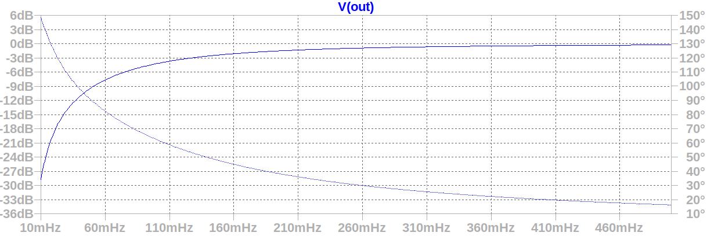
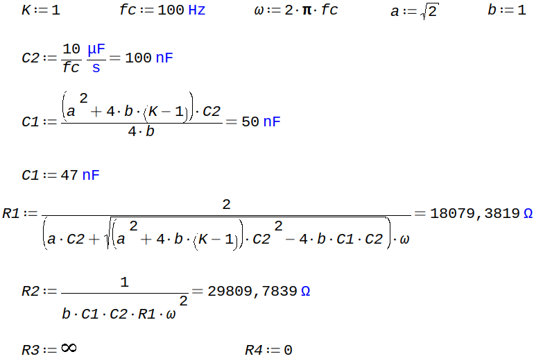

# Eletrocardiógrafo

Projeto para a disciplina PIN22107 do curso de Graduação em Engenharia Eletrônica do Instituto Federal de Santa Catarina. Consiste no projeto e execução de um eletrocardiógrafo de baixo consumo energético capaz de adquirir um sinal de eletrocardiograma por meio de 3 eletrodos e enviar suas medições para um aplicativo de aparelho celular.

## Especificações de projeto
* Baixo consumo energético.

* Capaz de medir sinais entre 0,05 e 100 Hz.

## Etapas do projeto
* **Aquisição do sinal:** Por meio de eletrodos conectados ao paciente, verificando e garantindo a proteção do mesmo, com processo de isolamento do sistema. Os sinais obtidos diretamente do eletrodo tem amplitude reduzida, atingindo 1 mV com uma frequência na faixa entre 0,05 e 100 Hz. Desse modo, para uma melhor visualização e manipulação, uma etapa de amplificação é necessária, tomando cuidado com a rejeição de ruído de modo comum.

* **Filtros:** Um filtro passa faixa deve ser implementado para seleção da banda de operação desejada, este filtro pode ser composto por um passa altas em série com um passa baixas, além disso, deve-se atentar para o fato de que a frequência da rede elétrica pode afetar o sinal e, portanto, deve ser removida por meio de um filtro rejeita faixa, com alto fator de qualidade. 

* **Digitalização:**  A conversão do sinal analógico para digital pode ser realizada através de um conversor dedicado ou até mesmo por meio do conversor integrado de algum microcontrolador, como por exemplo o ATMEGA328p.

* **Processamento digital:** Envio dos dados para o aplicativo de celular.

## Fluxograma
Para uma melhor organização e visualização das etapas necessárias, foi construído o seguinte fluxograma:

## Aquisição do sinal

## Filtros
Os filtros passa-baixas, passa-altas e rejeita-faixa foram projetados conforme o equacionamento descrito pelo livro "Amplificadores Operacionais e Filtros Ativos". As simulações foram realizadas no _software_ LTspice XVII. Foi definido inicialmente ganho unitário para todos os filtros.

### Passa-altas
Projetou-se o filtro passa-altas com ganho unitário na estrutura _voltage-controlled voltage source_ (VCVS).

### Passa-baixas

No intuito de otimizar a eficiência energética do eletrocardiógrafo, foi analisada a possibilidade de implementar um filtro passa-baixas passivo, portanto foi realizada uma comparação entre o filtro projetado de 2ª ordem com um filtro passivo na simulação.

### Rejeita-faixa

Inicialmente, projetou-se o filtro notch ativo para rejeitar ruídos oriundos da rede elétrica de 60 Hz.

Entretanto, devido à sensibilidade deste filtro aos valores dos componentes utilizados, e a necessidade de um elevado fator de qualidade, concluiu-se que implementá-lo digitalmente seria uma alternativa mais apropriada.

## Automatic Gain Control (AGC)

## Somador

## Autores
* João Bassani
* Ricardo Cirio

## Bibliografia
1. PERTENCE Jr., A. **Amplificadores Operacionais e Filtros Ativos**. 7.ed. Porto Alegre: Artmed, 2012.
